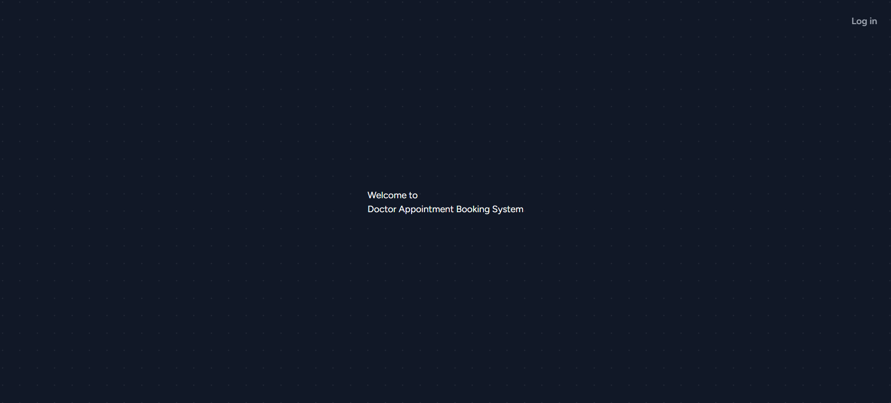
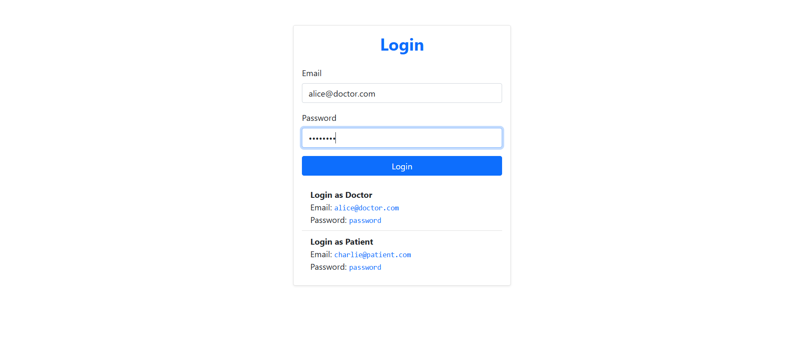
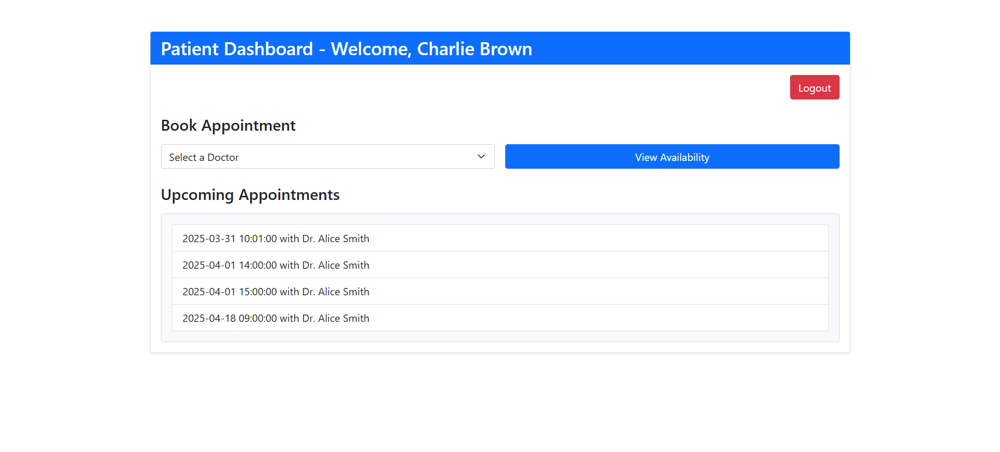
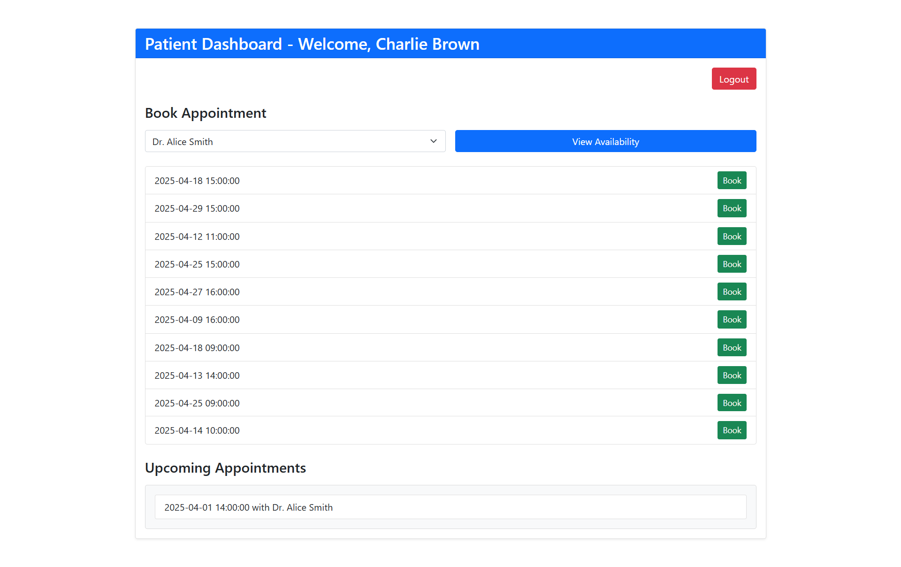
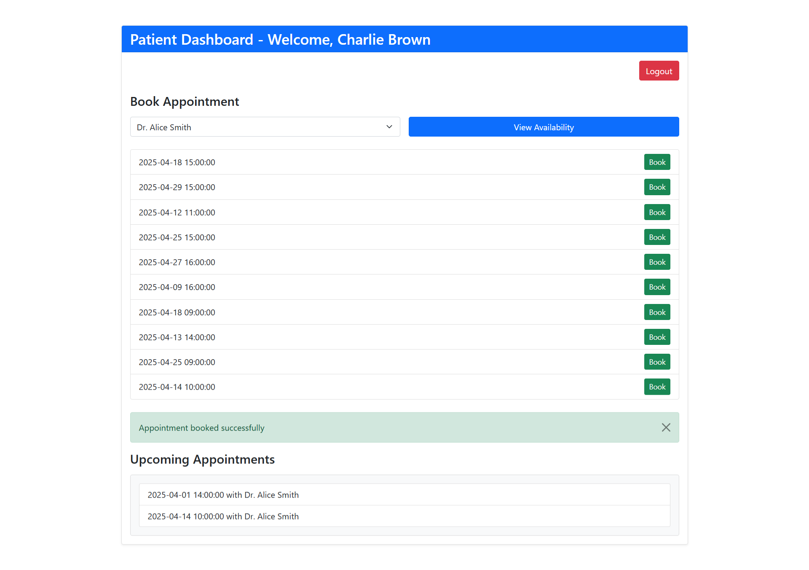
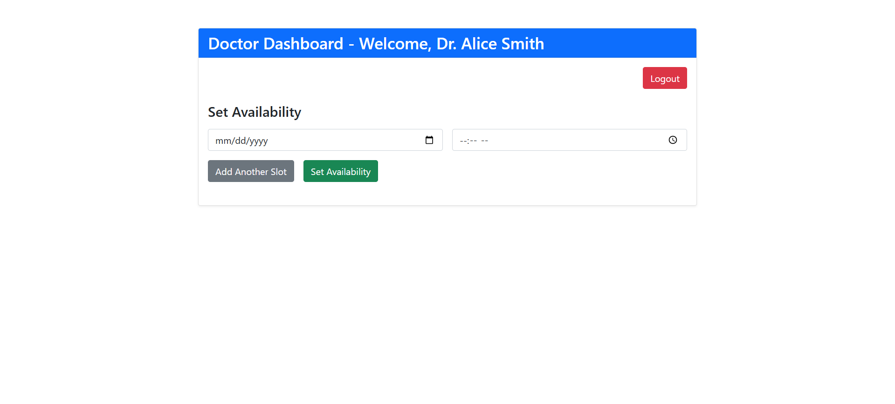
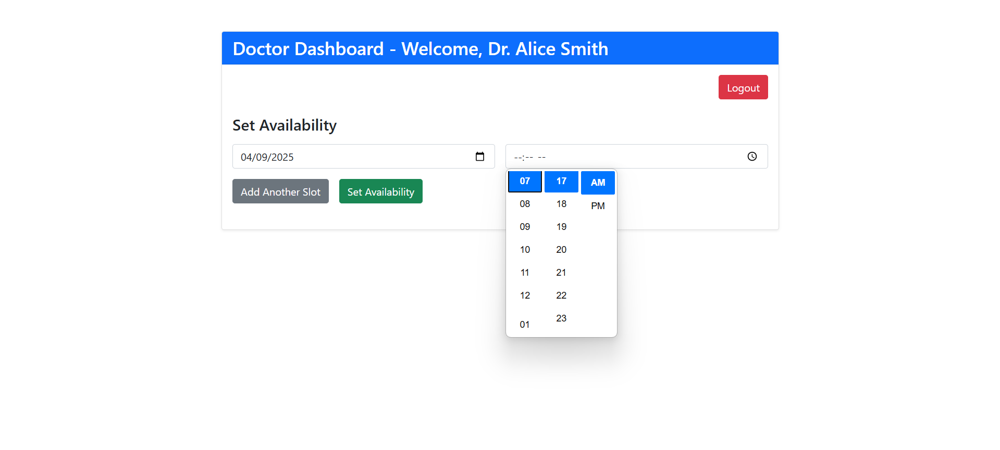

# Doctor Appointment System

A web-based application built with Laravel, Sanctum, and Bootstrap, allowing patients to book appointments with doctors and doctors to set their availability.

## Features
- **User Roles**: Patients and Doctors.
- **Authentication**: Token-based authentication using Laravel Sanctum.
- **Patient Dashboard**: View doctors, check availability, and book appointments.
- **Doctor Dashboard**: Set availability slots.
- **API-Driven**: RESTful API endpoints for managing appointments and availability.

## Prerequisites
Before running the project, ensure you have the following installed:
- [PHP](https://www.php.net/) (>= 8.1)
- [Composer](https://getcomposer.org/) (>= 2.0)
- [Node.js](https://nodejs.org/) (>= 16.x) and npm
- [MySQL](https://www.mysql.com/) (>= 5.7) or another supported database
- [Git](https://git-scm.com/)

## Installation

### 1. Clone the Repository
```bash
git clone https://github.com/your-username/doctor-appointment-system.git
cd doctor-appointment-system
```

### 2. Install PHP Dependencies
Install Laravel dependencies via Composer:
```bash
composer install
```

### 3. Install JavaScript Dependencies
Install Node.js dependencies for Vite and Axios:
```bash
npm install
```

### 4. Configure Environment
Copy the `.env.example` file to `.env` and update it with your database credentials:
```bash
cp .env.example .env
```
Edit `.env`:
```env
APP_NAME="Doctor Appointment System"
APP_URL=http://localhost:8000

DB_CONNECTION=mysql
DB_HOST=127.0.0.1
DB_PORT=3306
DB_DATABASE=doctor_appointment_db
DB_USERNAME=root
DB_PASSWORD=
```
Generate an application key:
```bash
php artisan key:generate
```

### 5. Set Up Database
Create a MySQL database (e.g., `doctor_appointment_db`):
```sql
CREATE DATABASE doctor_appointment_db;
```
Run migrations to create tables:
```bash
php artisan migrate
```

### 6. Seed the Database
Populate the database with sample users (doctors and patients):
```bash
php artisan db:seed
```
**Sample Users**:
- **Doctor**: `alice@doctor.com` / `password`
- **Doctor**: `bob@doctor.com` / `password`
- **Patient**: `charlie@patient.com` / `password`

*Note*: Update `database/seeders/DatabaseSeeder.php` if you need custom data:
```php
use App\Models\User;

public function run()
{
    User::create([
        'name' => 'Dr. Alice Smith',
        'email' => 'alice@doctor.com',
        'password' => bcrypt('password'),
        'role' => 'doctor',
    ]);
    User::create([
        'name' => 'Dr. Bob Johnson',
        'email' => 'bob@doctor.com',
        'password' => bcrypt('password'),
        'role' => 'doctor',
    ]);
    User::create([
        'name' => 'Charlie Patient',
        'email' => 'charlie@patient.com',
        'password' => bcrypt('password'),
        'role' => 'patient',
    ]);
}
```

### 7. Run the Application

#### Start Laravel Server
```bash
php artisan serve
```
- The app will run on `http://localhost:8000`.

#### Start Vite Development Server
```bash
npm run dev
```
- This serves assets (CSS/JS) via `http://localhost:5173`.

*Note*: Both servers must run concurrently for the app to work fully.

## Project Structure
- **`app/Http/Controllers/API`**: API controllers (`AuthController`, `AvailabilityController`, `AppointmentController`).
- **`app/Http/Requests`**: Validation request classes (`BookAppointmentRequest`, `StoreAvailabilityRequest`).
- **`app/Models`**: Eloquent models (`User`, `DoctorAvailability`, `Appointment`).
- **`resources/views`**: Blade templates (`layouts/app.blade.php`, `patient.blade.php`, `doctor.blade.php`).
- **`routes/api.php`**: API routes.
- **`resources/js/app.js`**: Frontend JavaScript (e.g., Axios setup).

## Usage

### Welcome


### 1. Login
- **Endpoint**: `POST /api/v1/login`
- **Payload**:
  ```json
  {
      "email": "alice@doctor.com",
      "password": "password"
  }
  ```
- **Response**: Returns a token (store it in `localStorage` as `token`).
- After login, redirect to `/dashboard` (handled by frontend or middleware).



### 2. Patient Dashboard
- **URL**: `http://localhost:8000/dashboard` (logged in as a patient).
- **Features**:
  - View list of doctors.
  - Check availability for a selected doctor.
  - Book an appointment.
- **Sample Flow**:
  1. Login as `charlie@patient.com`.
  2. Select a doctor (e.g., "Dr. Alice Smith").



  3. View available slots (e.g., "2025-03-29 14:00").



  4. Click "Book" to reserve a slot.



### 3. Doctor Dashboard
- **URL**: `http://localhost:8000/dashboard` (logged in as a doctor).
- **Features**:
  - Set availability slots.
- **Sample Flow**:
  1. Login as `alice@doctor.com`.
  2. Add slots (e.g., "2025-03-29 14:00").



  3. Submit to save availability.



### 4. API Endpoints
- **Authentication**:
  - `POST /api/v1/register`: Register a new user.
  - `POST /api/v1/login`: Login and get a token.
  - `POST /api/v1/logout`: Logout (requires token).
- **Availability**:
  - `GET /api/v1/doctors`: List all doctors.
  - `GET /api/v1/doctors/{id}/availability`: Get available slots for a doctor.
  - `POST /api/v1/availability`: Set availability (doctor only).
- **Appointments**:
  - `POST /api/v1/appointments/book`: Book an appointment (patient only).
  - `GET /api/v1/appointments/{patientId}`: List patient’s appointments.

## Building for Production
1. Build assets:
   ```bash
   npm run build
   ```
2. Configure `.env` for production (e.g., `APP_ENV=production`, update `DB_*` settings).
3. Serve with a web server (e.g., Nginx/Apache) instead of `php artisan serve`.

This README should guide anyone to set up and run your project from scratch. Let me know if you need refinements!
